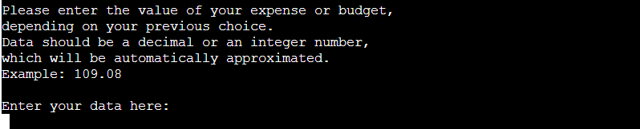

# Home Expenses Tracker
[View the live project here]()

Home Expenses Tracker is a command-line application that allows to set budgets and input basic home expenses such as bills, food, and car expenses throughout the year.
The application calculates the totals and compares them to budgets when set by the user or calculable.
The program's goal is to provide the user with an immediate understanding of essentials spendings and eventually to help better manage one's finances.
Home Expenses Tracker's target is young adults who just moved out from their parent's house and need to plan and manage their finances.
It also targets families with low incomes, who need to pay attention to any expense to stay within their budgets.

## FEATURES:

### Welcome Section
 

- This first section greets the user with a welcome message and requests to enter a number to choose the operation to perform from the presented list.
- If the input choice is not in the number range or not a number at all, the program displays a customized message error.

### Months Section

- This section requests the user to enter a number to choose the month relative to the previously selected operation.
- This section is displayed if:
  - The first choice is to update an expense;
  - The first choice is to set a monthly budget;
  - The first choice is to view a total and the choice of Total Type Section is 1.
- If the input choice is not in the number range or not a number at all, the program displays a customized message error.

### Input Section

- This section requests the user to enter the expense value to be registered or the budget's value to be set.
- If the input choice is not a positive number, the program displays a customized message error.

### Feedback Section

- In this section, the program sends feedback to the user explaining how it handles the input data by printing the worksheet updated, the month, and the new value. Updating a value also triggers an update of monthly and yearly totals; messages of the main steps of the operations are displayed here too.

### Budget Section

- This section shows messages about the comparison between
monthly and yearly expenses and their respective budgets.
- If the comparison is not possible, another sentence explains the reason on the terminal.
- This section is displayed if:
  - The first choice is to update an expense;
  - The first choice is to set a monthly budget.

### Restart/Leave Section

- In this section, the program requests the user to choose between exiting the app or restarting the program.
- If the input choice is: a letter but not y or n, not a letter at all, or more than one letter, the program displays a customized message error.

### Expense Type Section

- In this section, the program requests to enter a number to choose the expense type.
- This section is displayed if:
  - The first choice is to set a monthly budget;
  - The first choice is to view a total and the choice of Total Type Section is 2.
- If the input choice is not in the number range or not a number at all, the program displays a customized message error.

### View Total Section

- In this section, the program requests to choose which total to display: the total of expenses by month or the total of a specific expense type by year.
- If the input choice is not in the number range or not a number at all, the program displays a customized message error.

## Data Model:

## Testing:

<table>
<thead>
<tr>
<th>Action or Event</th>
<th>Expected Result</th>
<th>Successful?<th>
</tr>
</thead>
<tbody>
<tr>
<td>Run the program</td>
<td>Show welcome message and request of operation to execute</td>
<td>Yes</td>
</tr>
<tr>
<td>Type a number, not in the options range or a non-number</td>
<td>- Error message appears without stopping the program 
- Request again a valid input</td>
<td>Yes</td>
</tr>
<tr>
<td>To update a worksheet: type a number between 1 and 7</td>
<td>Access to month options</td>
<td>Yes</td>
</tr>
<tr>
<td>Type a number between 1 and 12</td>
<td>Request the value of the expense</td>
<td>Yes</td>
</tr>
<tr>
<td>Type a number less than 0 or a non-number</td>
<td>- Error message appears without stopping the program 
- Request again a valid input</td>
<td>Yes</td>
</tr>
<tr>
<td>Enter valid data</td>
<td>- Update the relevant worksheet and inform the user; 
    - If the entry is of a monthly bill, only one value per month will be allowed; 
    - If the entry is for car or food expenses, it's possible to add more values for the same month; 
    - Update the monthly total of the selected expense in the total worksheet and inform the user; 
    - Update Year Total in the total worksheet and inform the user; 
    - Access the monthly budget for the selected expense and compare it to the respective total by sending a message to the user; 
    - State the difference between monthly budget and total; 
    - If the value for the monthly budget is not present, inform the user; 
    - Access the yearly budget for the selected expense and compare it to the respective total by sending a message to the user; 
    - If the value for the yearly budget is not present, try to calculate it. If calculation is not possible due to missing information, inform the user
    - State the difference between yearly budget and total; 
    - Request to exit the game or continue with a new operation.
</td>
<td>Yes</td>
</tr>
<tr>
<td>Type "y"</td>
<td>Restart the program</td>
<td>Yes</td>
</tr>
<tr>
<td>Type "n"</td>
<td>Exit the program</td>
<td>Yes</td>
</tr>
<td>Type anything else</td>
<td>- Error message appears without stopping the program 
- Request again a valid input</td>
<td>Yes</td>
</tr>
<tr>
<td>To set a monthly budget: type 8</td>
<td>Access to expense type options</td>
<td>Yes</td>
</tr>
<tr>
<td>Type a number not in the options range or a non-number</td>
<td>- Error message appears without stopping the program 
- Request again a valid input</td>
<td>Yes</td>
</tr>
<tr>
<td>Enter valid number</td>
<td>Access to month options</td>
<td>Yes</td>
</tr>
<tr>
<td>Enter valid number</td>
<td>Request relevant budget input</td>
<td>Yes</td>
</tr>
<tr>
<td>Enter budget data</td>
<td>- Update budget worksheet and inform the user; 
    - Access the monthly total for the selected expense and compare it to the respective budget by sending a message to the user; 
    - State the difference between monthly budget and total; 
    - Access the yearly budget for the selected expense and compare it to the respective total by sending a message to the user; 
    - If the value for the yearly budget is not present, try to calculate it. - If calculation is not possible due to missing information, inform the user; 
    - State the difference between yearly budget and total; 
    - Request to exit the game or continue with a new operation.</td>
<td>Yes</td>
</tr>
<tr>
<td>To view totals: type 9</td>
<td>Access to total type options: by month or by expense type</td>
<td>Yes</td>
</tr>
<tr>
<td>Type 1</td>
<td>Access to month option</td>
<td>Yes</td>
</tr>
<tr>
<td>Select month number</td>
<td>- Print a message with the total of the expenses for the relevant month; - Request to exit the game or continue with a new operation.</td>
<td>Yes</td>
</tr>
<tr>
<td>Type 2</td>
<td>Access to expense type options</td>
<td>Yes</td>
</tr>
<tr>
<td>Type expense type number</td>
<td>- Print a message with the yearly total of the selected expense type; - Request to exit the game or continue with a new operation.</td>
<td>Yes</td>
</tr>
<tr>
</tbody>
</table>

### Validator Testing:
- PEP8 
No errors were returned when passing through the official [PEP8 validator]();
